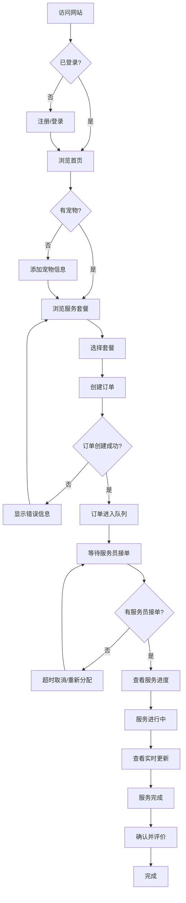
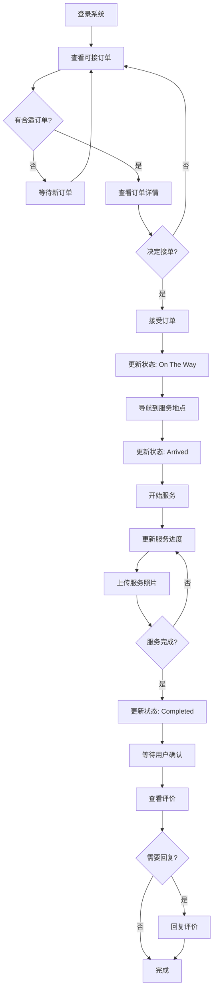

# CatCat 功能点与用户交互流程分析

## 📋 目录
1. [核心功能模块](#核心功能模块)
2. [用户角色与权限](#用户角色与权限)
3. [完整用户旅程](#完整用户旅程)
4. [正常流程](#正常流程)
5. [异常流程](#异常流程)
6. [代码问题分析](#代码问题分析)
7. [优化建议](#优化建议)

---

## 🎯 核心功能模块

### 1. 用户管理模块
| 功能 | 状态 | 异常处理 |
|------|------|----------|
| 用户注册 | ✅ | ⚠️ 缺少手机号验证 |
| 用户登录 | ✅ | ✅ 错误提示完善 |
| JWT刷新 | ✅ | ✅ Refresh Token机制 |
| 用户资料 | ✅ | ⚠️ 缺少头像上传 |
| 退出登录 | ✅ | ✅ Token失效 |

### 2. 宠物管理模块
| 功能 | 状态 | 异常处理 |
|------|------|----------|
| 添加宠物 | ✅ | ⚠️ 缺少必填字段验证 |
| 编辑宠物 | ✅ | ⚠️ 缺少所有权验证 |
| 删除宠物 | ✅ | ⚠️ 缺少关联订单检查 |
| 宠物列表 | ✅ | ✅ 空状态处理 |

### 3. 服务套餐模块
| 功能 | 状态 | 异常处理 |
|------|------|----------|
| 套餐列表 | ✅ | ✅ 缓存优化 |
| 套餐详情 | ✅ | ✅ Bloom Filter |
| 套餐搜索 | ❌ | ❌ 未实现 |

### 4. 订单管理模块
| 功能 | 状态 | 异常处理 |
|------|------|----------|
| 创建订单 | ✅ | ⚠️ 时间冲突检查缺失 |
| 订单队列 | ✅ | ✅ NATS JetStream |
| 订单列表 | ✅ | ✅ 分页+筛选 |
| 订单详情 | ✅ | ✅ 完善 |
| 取消订单 | ✅ | ⚠️ 退款逻辑缺失 |
| 订单状态变更 | ✅ | ⚠️ 状态机不完整 |

### 5. 服务进度模块
| 功能 | 状态 | 异常处理 |
|------|------|----------|
| 进度创建 | ✅ | ⚠️ 权限验证不足 |
| 进度查询 | ✅ | ✅ 缓存优化 |
| 实时更新 | ⚠️ | ⚠️ 应改为WebSocket |
| 照片上传 | ⚠️ | ❌ 未实现 |

### 6. 评价系统
| 功能 | 状态 | 异常处理 |
|------|------|----------|
| 创建评价 | ✅ | ⚠️ 重复评价检查 |
| 服务员回复 | ✅ | ✅ 权限验证 |
| 评价列表 | ✅ | ✅ 分页 |

### 7. 管理后台
| 功能 | 状态 | 异常处理 |
|------|------|----------|
| 用户管理 | ✅ | ✅ 完善 |
| 宠物管理 | ✅ | ✅ 完善 |
| 套餐管理 | ✅ | ✅ 完善 |
| 统计数据 | ✅ | ✅ 缓存 |

---

## 👥 用户角色与权限

### 角色定义
```
Customer (1)        → 普通用户（养猫人）
ServiceProvider (2) → 服务提供者（上门服务员）
Admin (99)          → 管理员
```

### 权限矩阵

| 功能 | Customer | ServiceProvider | Admin |
|------|----------|-----------------|-------|
| 查看自己订单 | ✅ | ✅ | ✅ |
| 创建订单 | ✅ | ❌ | ✅ |
| 接受订单 | ❌ | ✅ | ❌ |
| 更新服务进度 | ❌ | ✅ | ❌ |
| 取消订单 | ✅ (限制条件) | ✅ (限制条件) | ✅ |
| 评价服务 | ✅ | ❌ | ❌ |
| 回复评价 | ❌ | ✅ | ❌ |
| 管理用户 | ❌ | ❌ | ✅ |
| 管理套餐 | ❌ | ❌ | ✅ |

---

## 🚀 完整用户旅程

### C端用户（Customer）完整旅程



### B端用户（ServiceProvider）完整旅程



---

## ✅ 正常流程详细分析

### 1. 用户注册登录流程

**步骤：**
1. 用户输入手机号和密码
2. 后端验证手机号格式
3. 检查手机号是否已注册
4. 密码哈希存储
5. 生成Access Token + Refresh Token
6. 返回JWT Token

**问题点：**
- ⚠️ **缺少手机号验证码**
- ⚠️ **缺少图形验证码**
- ⚠️ **密码强度检查不足**

**优化建议：**
```csharp
// 添加手机号验证
public interface ISmsService
{
    Task<Result> SendVerificationCodeAsync(string phone);
    Task<Result<bool>> VerifyCodeAsync(string phone, string code);
}
```

---

### 2. 创建订单流程

**当前流程：**
```
用户选择套餐 
→ 填写服务信息 
→ 提交订单 
→ 进入NATS队列 
→ 后台处理 
→ 插入数据库
```

**问题点：**
1. ⚠️ **缺少时间冲突检查**（同一服务员同时段订单）
2. ⚠️ **缺少余额检查**（预付费模式）
3. ⚠️ **缺少服务区域检查**（服务员服务范围）
4. ⚠️ **缺少订单重复提交防护**

**优化建议：**
```csharp
public async Task<Result<long>> CreateOrderAsync(CreateOrderCommand command)
{
    // 1. 检查宠物是否存在且属于该用户
    var pet = await petRepository.GetByIdAsync(command.PetId);
    if (pet == null || pet.UserId != command.UserId)
        return Result.Failure<long>("Pet not found or access denied");

    // 2. 检查套餐是否可用
    var package = await packageRepository.GetByIdAsync(command.PackageId);
    if (package == null || !package.IsActive)
        return Result.Failure<long>("Package not available");

    // 3. 检查时间冲突（同一用户同时段订单）
    var hasConflict = await orderRepository.HasTimeConflictAsync(
        command.UserId, 
        command.ScheduledTime, 
        package.Duration);
    if (hasConflict)
        return Result.Failure<long>("Time conflict with existing order");

    // 4. 检查余额（如果是预付费）
    if (requirePrepayment)
    {
        var balance = await userRepository.GetBalanceAsync(command.UserId);
        if (balance < package.Price)
            return Result.Failure<long>("Insufficient balance");
    }

    // 5. 幂等性检查（防止重复提交）
    var cacheKey = $"order:create:{command.UserId}:{command.PackageId}";
    var existingOrderId = await cache.GetAsync<long?>(cacheKey);
    if (existingOrderId.HasValue)
        return Result.Success(existingOrderId.Value);

    // 6. 创建订单并发送到队列
    var message = new OrderQueueMessage(...);
    await natsConnection.PublishAsync("order.queue", message);

    // 7. 缓存订单ID（5分钟内防止重复提交）
    await cache.SetAsync(cacheKey, orderId, TimeSpan.FromMinutes(5));

    return Result.Success(orderId);
}
```

---

### 3. 服务进度更新流程

**当前流程：**
```
服务员创建进度更新 
→ 插入数据库 
→ 清除缓存 
→ 返回成功
```

**问题点：**
1. ⚠️ **权限验证不足**（需要确认是该订单的服务员）
2. ⚠️ **状态顺序检查缺失**（不能跳过状态）
3. ⚠️ **照片上传未实现**
4. ⚠️ **缺少实时推送**（应该用WebSocket）

**优化建议：**
```csharp
public async Task<Result<long>> CreateProgressAsync(CreateProgressCommand command)
{
    // 1. 获取订单并验证权限
    var order = await orderRepository.GetByIdAsync(command.OrderId);
    if (order == null)
        return Result.Failure<long>("Order not found");

    if (order.ServiceProviderId != command.ServiceProviderId)
        return Result.Failure<long>("Access denied");

    // 2. 验证订单状态（只有Accepted或InProgress可以更新进度）
    if (order.Status != OrderStatus.Accepted && order.Status != OrderStatus.InProgress)
        return Result.Failure<long>("Order status invalid for progress update");

    // 3. 验证进度状态顺序（不能跳过）
    var latestProgress = await repository.GetLatestByOrderIdAsync(command.OrderId);
    if (latestProgress != null)
    {
        if (!IsValidStatusTransition(latestProgress.Status, command.Status))
            return Result.Failure<long>("Invalid status transition");
    }

    // 4. 创建进度记录
    var progress = new ServiceProgress { ... };
    var progressId = await repository.CreateAsync(progress);

    // 5. 更新订单状态（如果需要）
    if (command.Status == ServiceProgressStatus.StartService && order.Status == OrderStatus.Accepted)
    {
        await orderRepository.UpdateStatusAsync(order.Id, OrderStatus.InProgress);
    }

    // 6. 清除缓存
    await cache.RemoveAsync($"progress:order:{command.OrderId}");

    // 7. 发送实时通知（WebSocket）
    await notificationHub.SendToUserAsync(
        order.CustomerId, 
        "ProgressUpdated", 
        new { orderId = order.Id, progress });

    // 8. 发送NATS事件（用于其他服务消费）
    await natsConnection.PublishAsync("order.progress", 
        new OrderProgressEvent { OrderId = order.Id, Progress = progress });

    return Result.Success(progressId);
}

private bool IsValidStatusTransition(ServiceProgressStatus from, ServiceProgressStatus to)
{
    // 定义允许的状态转换
    var allowedTransitions = new Dictionary<ServiceProgressStatus, List<ServiceProgressStatus>>
    {
        [ServiceProgressStatus.OnTheWay] = new() { ServiceProgressStatus.Arrived },
        [ServiceProgressStatus.Arrived] = new() { ServiceProgressStatus.StartService },
        [ServiceProgressStatus.StartService] = new() { 
            ServiceProgressStatus.Feeding, 
            ServiceProgressStatus.CleaningLitter, 
            ServiceProgressStatus.Playing 
        },
        [ServiceProgressStatus.Feeding] = new() { 
            ServiceProgressStatus.CleaningLitter, 
            ServiceProgressStatus.Playing, 
            ServiceProgressStatus.Grooming,
            ServiceProgressStatus.Completed 
        },
        // ... 其他状态转换
    };

    return allowedTransitions.TryGetValue(from, out var allowed) && allowed.Contains(to);
}
```

---

## ❌ 异常流程分析

### 1. 订单创建失败

**异常场景：**
| 场景 | 原因 | 当前处理 | 建议改进 |
|------|------|----------|----------|
| 宠物不存在 | PetId无效 | ❌ 数据库错误 | ✅ 返回友好提示 |
| 套餐不可用 | PackageId无效 | ❌ 数据库错误 | ✅ 返回套餐状态 |
| 时间冲突 | 同时段已有订单 | ❌ 未检查 | ✅ 提示冲突订单 |
| 余额不足 | 预付费余额不够 | ❌ 未实现 | ✅ 返回余额信息 |
| 服务区域外 | 地址不在服务范围 | ❌ 未检查 | ✅ 显示服务区域 |
| 重复提交 | 用户多次点击 | ❌ 可能重复 | ✅ 幂等性保护 |

---

### 2. 订单取消流程

**当前问题：**
```csharp
// 当前代码 - CancelOrderAsync
public async Task<Result> CancelOrderAsync(long orderId, string reason)
{
    var order = await repository.GetByIdAsync(orderId);
    if (order == null)
        return Result.Failure("Order not found");

    // ⚠️ 问题1: 没有检查订单状态（已完成的不能取消）
    // ⚠️ 问题2: 没有检查取消时限（服务开始后不能取消）
    // ⚠️ 问题3: 没有退款逻辑
    // ⚠️ 问题4: 没有通知服务员

    order.Status = OrderStatus.Cancelled;
    await repository.UpdateAsync(order);

    return Result.Success();
}
```

**改进方案：**
```csharp
public async Task<Result> CancelOrderAsync(long orderId, long userId, string reason)
{
    var order = await repository.GetByIdAsync(orderId);
    if (order == null)
        return Result.Failure("Order not found");

    // 1. 权限检查
    if (order.CustomerId != userId)
        return Result.Failure("Access denied");

    // 2. 状态检查
    if (order.Status == OrderStatus.Completed || order.Status == OrderStatus.Cancelled)
        return Result.Failure("Order cannot be cancelled");

    // 3. 时间检查（服务开始前2小时不能取消）
    var now = DateTime.UtcNow;
    var scheduledTime = DateTime.Parse(order.ScheduledTime);
    var hoursUntilService = (scheduledTime - now).TotalHours;

    if (hoursUntilService < 2 && order.Status != OrderStatus.Queued)
        return Result.Failure("Cannot cancel within 2 hours of service time");

    // 4. 退款处理
    var refundResult = await paymentService.RefundAsync(order.Id);
    if (!refundResult.IsSuccess)
    {
        logger.LogError("Refund failed for order {OrderId}: {Error}", 
            orderId, refundResult.Error);
        // 继续取消，但记录退款失败
    }

    // 5. 更新订单状态
    order.Status = OrderStatus.Cancelled;
    order.CancelReason = reason;
    order.CancelledAt = DateTime.UtcNow;
    await repository.UpdateAsync(order);

    // 6. 通知服务员（如果已分配）
    if (order.ServiceProviderId.HasValue)
    {
        await notificationHub.SendToUserAsync(
            order.ServiceProviderId.Value,
            "OrderCancelled",
            new { orderId, reason });
    }

    // 7. 发送NATS事件
    await natsConnection.PublishAsync("order.cancelled", 
        new OrderCancelledEvent { OrderId = orderId, Reason = reason });

    return Result.Success();
}
```

---

### 3. 服务员无响应

**场景：** 订单创建后，长时间无服务员接单

**当前处理：** ❌ 未处理

**改进方案：**
```csharp
// 在OrderProcessingService中添加超时检查
public class OrderProcessingService : BackgroundService
{
    protected override async Task ExecuteAsync(CancellationToken stoppingToken)
    {
        // 原有的队列处理逻辑...

        // 新增：超时检查任务
        _ = Task.Run(() => CheckOrderTimeoutsAsync(stoppingToken), stoppingToken);
    }

    private async Task CheckOrderTimeoutsAsync(CancellationToken stoppingToken)
    {
        while (!stoppingToken.IsCancellationRequested)
        {
            try
            {
                // 查询Pending状态超过30分钟的订单
                var timeoutOrders = await orderRepository
                    .GetPendingOrdersOlderThanAsync(TimeSpan.FromMinutes(30));

                foreach (var order in timeoutOrders)
                {
                    logger.LogWarning("Order {OrderId} timeout, reassigning...", order.Id);

                    // 方案1: 自动取消并退款
                    await orderService.CancelOrderAsync(order.Id, 
                        "Timeout: No service provider available");

                    // 方案2: 提高价格重新分配
                    order.Price *= 1.2m; // 价格提升20%
                    order.Status = OrderStatus.Queued;
                    await orderRepository.UpdateAsync(order);

                    // 通知用户
                    await notificationHub.SendToUserAsync(
                        order.CustomerId,
                        "OrderReassigned",
                        new { orderId = order.Id, newPrice = order.Price });
                }

                await Task.Delay(TimeSpan.FromMinutes(5), stoppingToken);
            }
            catch (Exception ex)
            {
                logger.LogError(ex, "Error checking order timeouts");
            }
        }
    }
}
```

---

### 4. 支付失败处理

**当前问题：** 支付逻辑未完全实现

**改进方案：**
```csharp
public async Task<Result> ProcessPaymentAsync(long orderId)
{
    var order = await orderRepository.GetByIdAsync(orderId);
    if (order == null)
        return Result.Failure("Order not found");

    try
    {
        // 1. 调用支付服务（Stripe）
        var paymentResult = await stripeService.ChargeAsync(
            order.CustomerId,
            order.TotalPrice,
            order.OrderNo);

        if (!paymentResult.IsSuccess)
        {
            // 2. 支付失败 - 更新订单状态
            order.PaymentStatus = "Failed";
            order.Status = OrderStatus.Cancelled;
            await orderRepository.UpdateAsync(order);

            // 3. 记录支付日志
            await paymentRepository.CreateAsync(new Payment
            {
                OrderId = orderId,
                Amount = order.TotalPrice,
                Status = "Failed",
                FailureReason = paymentResult.Error,
                CreatedAt = DateTime.UtcNow
            });

            // 4. 通知用户
            await notificationHub.SendToUserAsync(
                order.CustomerId,
                "PaymentFailed",
                new { orderId, reason = paymentResult.Error });

            return Result.Failure($"Payment failed: {paymentResult.Error}");
        }

        // 5. 支付成功 - 更新状态
        order.PaymentStatus = "Paid";
        await orderRepository.UpdateAsync(order);

        await paymentRepository.CreateAsync(new Payment
        {
            OrderId = orderId,
            Amount = order.TotalPrice,
            Status = "Success",
            TransactionId = paymentResult.Value,
            CreatedAt = DateTime.UtcNow
        });

        return Result.Success();
    }
    catch (Exception ex)
    {
        logger.LogError(ex, "Payment processing error for order {OrderId}", orderId);
        return Result.Failure("Payment processing error");
    }
}
```

---

## 🔧 代码问题总结与优化建议

### 高优先级问题

| 问题 | 位置 | 风险等级 | 修复建议 |
|------|------|---------|----------|
| 缺少权限验证 | ServiceProgressEndpoints | 🔴 高 | 添加订单所有权检查 |
| 缺少时间冲突检查 | OrderService.CreateOrder | 🔴 高 | 实现时间段冲突检测 |
| 缺少状态机验证 | OrderService | 🔴 高 | 实现订单状态转换规则 |
| 缺少幂等性保护 | OrderService.CreateOrder | 🔴 高 | 添加分布式锁或缓存 |
| 退款逻辑未实现 | OrderService.CancelOrder | 🟡 中 | 实现Stripe退款 |
| 照片上传未实现 | ServiceProgress | 🟡 中 | 集成OSS |
| 缺少手机验证 | AuthService | 🟡 中 | 集成短信服务 |

### 中优先级问题

| 问题 | 位置 | 风险等级 | 修复建议 |
|------|------|---------|----------|
| 实时通知未实现 | 全局 | 🟡 中 | 添加SignalR |
| 缺少订单超时处理 | OrderProcessingService | 🟡 中 | 添加定时检查 |
| 缺少余额检查 | OrderService | 🟡 中 | 实现预付费逻辑 |
| 缺少服务区域检查 | OrderService | 🟢 低 | 实现地理围栏 |

---

## 📋 立即需要实施的优化清单

### Phase 1: 安全与权限（本次实施）
- [ ] 服务进度权限验证
- [ ] 订单状态机完善
- [ ] 幂等性保护
- [ ] 时间冲突检查

### Phase 2: 业务流程（下一步）
- [ ] 退款逻辑实现
- [ ] 订单超时处理
- [ ] 余额检查
- [ ] 支付流程完善

### Phase 3: 用户体验（后续）
- [ ] WebSocket实时通知
- [ ] 照片上传功能
- [ ] 手机号验证
- [ ] 服务区域检查

---

**下一步行动：** 立即开始Phase 1的代码优化实施。

*Last Updated: 2025-10-03*

